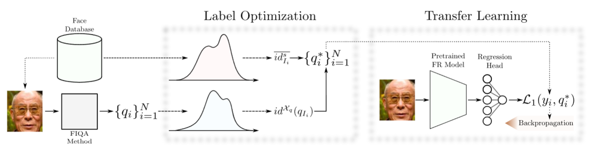
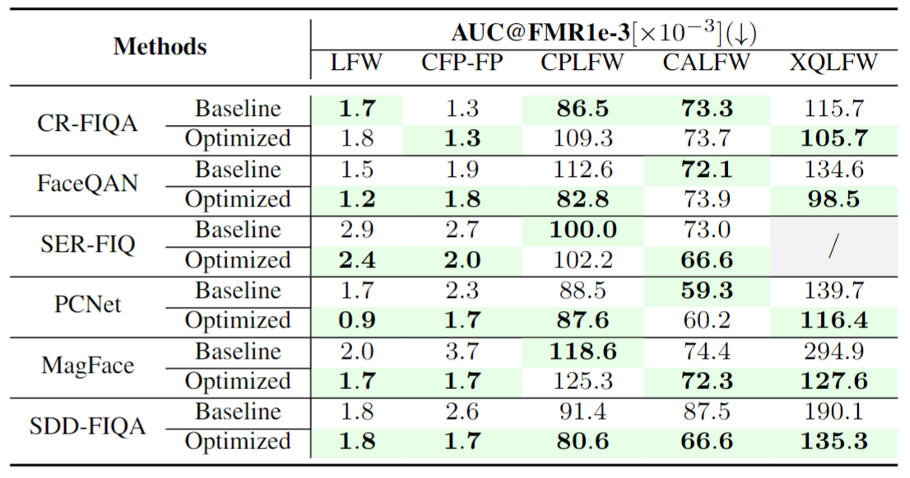
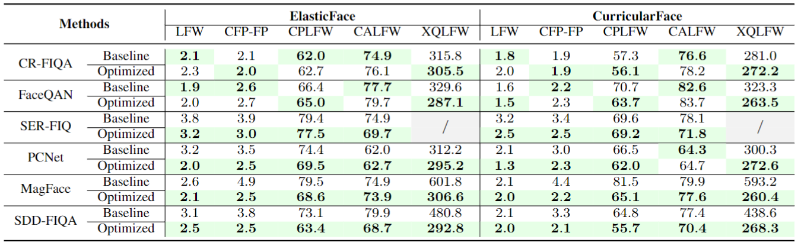

# **Optimization-Based-Improvement-of-FIQA-Techniques**

Official repository of the paper [__Optimization-Based Improvement of Face Image
Quality Assessment Techniques__](https://lmi.fe.uni-lj.si/wp-content/uploads/2023/03/IWBF_23___paper-1.pdf) presented at __IWBF 2023__.


# **Table of Contents**

- [**Optimization-Based Improvement of Face Image
Quality Assessment Techniques** _(Official repository)_](#faceqan-official-repository)
  - [**Table of Contents**](#table-of-contents)
  - [**1. Method overview**](#1-faceqan-overview)
    - [**Abstract**](#abstract)
    - [**Methodology**](#methodology)
    - [**Results**](#results)
  - [**2. Running the code**](#2-how-to)
    - [**Quality score optimization**](#quality-score-inference)
    - [**Transfer learning**](#xqlfw-evaluation)
  - [**3. Citation**](#3-citation)


# **Method Overview**

## **Abstract**

Contemporary face recognition (FR) models achieve near-ideal recognition performance in constrained settings, yet do not fully translate the performance to unconstrained (real-world) scenarios. To help improve the performance and stability of FR systems in such unconstrained settings, face image quality assessment (FIQA) techniques try to infer sample-quality information from the input face images that can aid with the recognition process. While existing FIQA techniques are able to efficiently capture the differences between high and low quality images, they typically cannot fully distinguish between images of similar quality, leading to lower performance in many scenarios. To address this issue, we present in this paper a supervised quality-label optimization approach, aimed at improving the performance of existing FIQA techniques. The developed optimization procedure infuses additional information (computed with a selected FR model) into the initial quality scores generated with a given FIQA technique to produce better estimates of the “actual” image quality. We evaluate the proposed approach in comprehensive experiments with six state-of-the-art FIQA approaches (CRFIQA, FaceQAN, SER-FIQ, PCNet, MagFace, SER-FIQ) on five commonly used benchmarks (LFW, CFP-FP, CPLFW, CALFW, XQLFW) using three targeted FR models (ArcFace, ElasticFace, CurricularFace) with highly encouraging results.

## **Methodology**



**Overview of the proposed method that consists of: Label Optimization and Transfer Learning.** The label-optimization step incorporates information extracted from mated image pairs into quality scores precomputed with an existing FIQA technique. The transfer-learning step is then used to train a FR model, extended with a regression head, on the optimized quality-scores. The learned regressor is finally utilized for quality estimation.


## **Results**



**Same-Model Performance Comparison.** Comparison of AUC
scores between baseline FIQA methods (baseline) and our
proposed optimization approach (optimized) using ArcFace for
quality estimation and performance evaluation. Best results
are highlighted in green.



**Cross-Model Performance Comparison.** Comparison of AUC scores between the baseline FIQA methods (baseline) and the proposed optimization approach (optimized), using the ArcFace model for quality estimation and ElasticFace and CurricularFace for performance scoring. Best results are highlighted in green.

# **Running the Code**


## **Environment Setup**

> We strongly suggest using Conda to setup the necessary environment.

  1. Create and activate a new conda environment:
    ```conda create -n 'name' python=3.8```
  
  2. Activate the environment:
    ```conda activate 'name'```

  2. Install PyTorch using:
    ``` conda install pytorch torchvision torchaudio cudatoolkit=XX.X -c pytorch ```
            
      > Replace XX.X with the appropriate CUDA version for your graphics card.
  
  3. Install other needed libraries:
      
      - ```conda install wandb --channel conda-forge```
      - ```conda install -c conda-forge tqdm```
      - ```conda install pillow```
      - ```conda install scikit-learn -c conda-forge```

## **Iterative Optimization**

To run the iterative optimization code, please consult to the instructions at "./src/iterative_optimization"

## **Transfer Learning**

To run the transfer learning code, please consult to the instructions at "./src/transfer_learning"


# **Citation**

If you use any of the code provided in this repository or find this research useful, please cite the following paper:

``` 
 @inproceedings{babnikIWBF2022,
  title={{Optimization-Based Improvement of Face Image Quality Assessment Techniques}},
  author={Babnik, {\v{Z}}iga and Damer, Naser and {\v{S}}truc, Vitomir},
  booktitle={Proceedings of the International Workshop on Biometrics and Forensics (IWBF)},
  year={2023},
}
``` 


